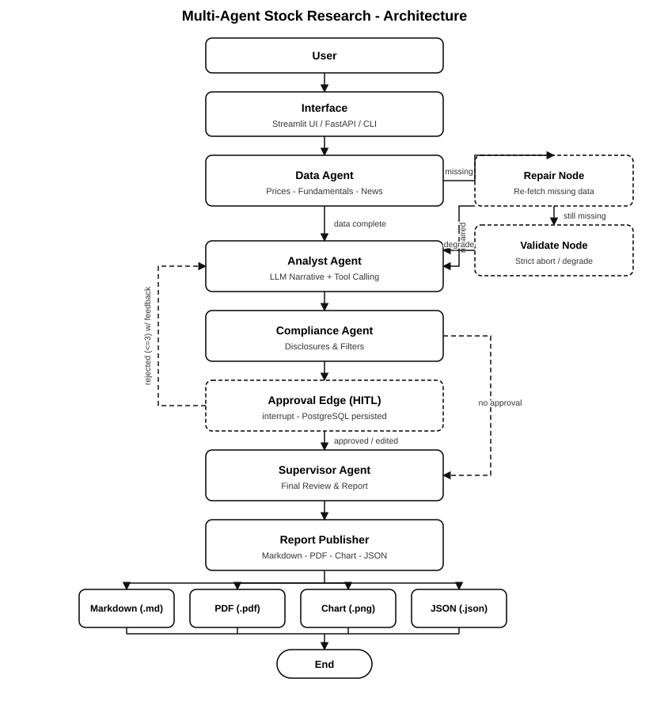
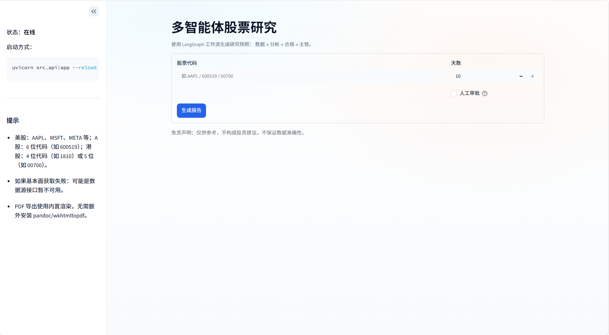

# 多智能体股票研究（基于 LangChain + LangGraph）

[](https://www.python.org/downloads/)
[](https://github.com/langchain-ai/langchain)

[](LICENSE)
[](https://fastapi.tiangolo.com)
[](https://www.deepseek.com)


---

## 项目结构

```text
multiagent-stock-research/
├── src/
│   ├── agents/                  # 数据 / 分析 / 合规 / 主管 智能体
│   ├── graph/
│   │   ├── orchestrator.py      # LangGraph 编排：条件路由、修复/校验、审批边（HITL）
│   │   └── precheck.py          # 股票预检共享函数
│   ├── runtime/
│   │   ├── run_manager.py       # 异步运行时代理（进程内执行）
│   │   ├── runner.py            # Worker 侧执行器（Celery 调用）
│   │   ├── graph_stream.py      # 共享流式执行器
│   │   ├── backends.py          # Redis/内存事件总线、缓存、短期记忆
│   │   ├── memory.py            # 长期记忆（pgvector / 内存）+ 压缩
│   │   ├── ratelimit.py         # 主动限流（内存/Redis）
│   │   ├── db.py                # asyncpg runs 注册表
│   │   └── embedder.py          # 文本嵌入（OpenAI/哈希）
│   ├── observability/           # Prometheus 指标、LLM token/成本埋点、pricing
│   ├── celery_app.py            # Celery App（Redis broker、优先级/死信）
│   ├── tasks.py                 # Celery 任务：run/resume 研究、死信
│   ├── tools/                   # 行情 / 基本面 / 新闻 / 绘图 / PDF
│   ├── guardrails/              # 输入规范化与输出中立性
│   └── config/settings.yaml     # LLM provider、严格模式、新闻源
├── frontend/                    # Vue 3 + TS + Pinia + Router + Element Plus（SSE 实时）
├── docs/
│   ├── Multiagent.svg           # 架构图（SVG，GitHub 原生渲染）
│   ├── architecture.md          # 架构说明（中文）
│   ├── grafana_dashboard.json   # Grafana 面板（自动导入）
│   └── Screenshots/UI.png       # UI 截图
├── Dockerfile.backend           # 后端镜像（依赖层缓存 + pip 缓存）
├── frontend/Dockerfile          # Vue 构建（node）→ nginx
├── frontend/nginx.conf          # /api 反代 + SSE（关缓冲）
├── docker-compose.yml           # api / worker / db(pgvector) / redis / frontend / prometheus / grafana
├── prometheus.yml               # 抓取 api:8000/metrics
├── grafana/                     # 预配置数据源 + 面板
├── requirements.txt             # 运行时依赖（Docker 缓存层）
├── pyproject.toml               # 依赖与元数据（uv）
├── uv.lock
├── .github/workflows/           # CI（ruff/black/pytest）+ CD（镜像推送）
├── .env.example                 # 环境变量模板（.env 不入库）
└── README.md
```

---

## 快速启动：Docker（推荐）| 一键启动

容器化整套（后端 API + Celery worker + PostgreSQL/pgvector + Redis + Vue 前端 + Prometheus + Grafana）一条命令：

```bash
cp .env.example .env          # 填入你的 ALPHA_VANTAGE_API_KEY / DEEPSEEK_API_KEY
docker compose up -d --build
```

- Vue 前端（nginx）：http://localhost:8080 — SPA，实时 SSE 进度
- FastAPI：http://localhost:8000 — `/health`、`/metrics`、`/api/research*`
- Prometheus：http://localhost:9090（抓取 `api:8000/metrics`）
- Grafana：http://localhost:3000 — `admin/admin`，面板自动导入

`POST /api/research` 立即返回 `run_id`；Celery worker 执行 LangGraph 流水线，把节点事件发到 Redis 事件总线（经 SSE 暴露），并把状态/结果持久化到 Postgres。HITL 审批通过 `/decision` 恢复。

本地运行（不用 Docker）：
```bash
uv sync --extra dev
uv run uvicorn src.api:app --reload --port 8000        # 后端
cd frontend && npm ci && npm run dev                   # Vue UI（vite，代理 /api）
```

> 美股需要可用的 Alpha Vantage key（免费版 25 次/天）；港股（如 `00700`）走 AKShare，无需该配额。

## 端到端验证与关键修复

一次完整的 `docker compose up` 跑通后发现并**修复**了三个真实问题：

- asyncpg 无法把 run 的 `result`（dict）写入 `jsonb` 列（`expected str, got dict`），导致状态永远到不了 `success`。已在 `src/runtime/db.py` 给连接池注册 `jsonb` 编解码器（`encoder=json.dumps, decoder=json.loads`）。
- 容器内 PDF 导出缺中文字体（`未找到可用的中文字体`）。已在 `Dockerfile.backend` 安装 `fonts-noto-cjk`。
- PDF 报 `Undefined font: cjkB`（没找到粗体字体）。已在 `src/tools/pdf_tool.py` 里，当无独立粗体时用常规字体注册成 `B`。

同时优化了镜像构建：依赖从 `requirements.txt` 装在独立缓存层 + BuildKit pip 缓存挂载，本地包用 `--no-deps` 安装——纯改代码的构建从约 20 分钟降到约 20 秒。

以港股 `00700` 端到端验证：提交 → Celery worker → 收集（AKShare）→ 分析 → 合规 → 主管 → 生成 `report.md` + `.pdf` + `.png` + `.json`，状态 `success`。

---

## 这个项目为什么存在

金融研究的世界已经发生了演变——分析师现在依赖自动化、AI 和实时数据，而不是 Excel 表格和手工基本面分析。
本项目演示了一个**最小可投入生产的多智能体研究系统**，使用 **LangChain + LangGraph** 构建，旨在自动化：

- 历史股价分析
- 基本面数据获取
- 新闻跟踪
- 分析师风格的研究报告生成
- 合规过滤
- PDF + Markdown 研究报告（含图表）

无论你是开发者、量化研究员、分析师还是 AI 爱好者——本仓库展示了如何构建**真实的、由 LLM 驱动的工作流**，无需付费 API 数据源即可生成机构级研究报告。

---

## 主要功能

| 功能 | 说明 |
|------|------|
| **4 智能体架构** | DataAgent、AnalystAgent、ComplianceAgent、SupervisorAgent |
| **智能体工具调用** | 分析智能体在数据缺口下自主调用行情/基本面工具补充数据 |
| **条件路由 + 修复** | 数据缺失自动进入修复节点补充，失败时按 strict_mode 中止或降级 |
| **图表 + 统计** | 自动生成收益率统计 + matplotlib 股价图 |
| **实时新闻源集成** | RSS + Google News 兜底（美股/A 股/港股） |
| **PDF 报告生成** | 输出整洁的 Markdown 和 PDF 研究报告 |
| **免费数据源** | Alpha Vantage + AKShare + Google News RSS/东方财富公告 |
| **FastAPI 接口** | `/api/research`（异步，返回 run_id）+ `/analyze`（同步，兼容旧 CLI） |
| **错误处理** | 跳过未知股票代码、记录边界情况、继续执行流水线 |
| **人在回路（Postgres）** | 审批边 interrupt：批准/驳回/修改，状态经 PostgreSQL 持久化可跨进程恢复 |
| **异步任务 + SSE** | `POST /api/research` 立即返回 run_id；节点事件经 Redis 事件总线 → SSE `/stream` 实时推送 |
| **Celery / Redis 队列** | 独立 worker 执行；`research` / `research_high`（审批）优先级队列 + 失败重试与死信 |
| **分层记忆** | 短期（Redis 滑动窗口）+ 长期（pgvector 嵌入/重要性/衰减/检索）+ 压缩（LLM 摘要/裁剪） |
| **可观测性** | 结构化 JSON 日志 + `/metrics`（Prometheus）+ 节点级 token/耗时/成本 + Grafana 面板 |
| **一键部署** | `docker compose up -d --build`：api/worker/db/redis/frontend/prometheus/grafana |

---

## 技术栈

| 层级 | 技术 |
|------|------|
| 编排 | LangGraph、LangChain |
| 后端 API | FastAPI |
| LLM 模型 | DeepSeek（deepseek-v4-flash-vision-exp）· 可切换 OpenAI（用 `LLM_MODEL` / `settings.yaml` 配置） |
| 数据工具 | Alpha Vantage、AKShare、Google News RSS、东方财富公告 |
| 文件格式 | Markdown、JSON、PDF |
| 异步运行时 | FastAPI async + `astream` 节点事件、SSE（`/stream`）、asyncpg runs 注册表 |
| 任务队列 | Celery worker + Redis broker（优先级 / 重试 / 死信队列） |
| 记忆/缓存 | Redis（事件总线 / 缓存 / 短期记忆）+ Postgres pgvector（长期记忆）+ 限流器 |
| 可观测 | Prometheus `/metrics` + 结构化 JSON 日志（`LOG_FORMAT=json`）+ Grafana 面板 |
| 前端 | Vue 3 + TS + Pinia + Vue Router + Element Plus（nginx 托管） |
| 日志 | 结构化 JSON（文件）via `logging` + 轮转 |
| 代码质量 | Black、Ruff、Pytest |
| PDF 渲染 | fpdf2（纯 Python，无外部依赖） |
| Python | 3.10+（Docker 镜像 3.11-slim） |

---
# 智能体职责矩阵
| 智能体 | 主要职责 | 输入依赖 | 输出产物 | 使用工具 |
|--------|----------|----------|----------|----------|
| **DataAgent** | 获取历史价格数据、关键财务指标和最新新闻 | 股票代码、天数 | `raw_data.json`、`prices`、`fundamentals`、`news` | Alpha Vantage、AKShare、Google News RSS、东方财富公告 |
| **AnalystAgent** | 解读数据并撰写叙述性摘要 | DataAgent 输出 | 分析师备注（文本） | LLM（DeepSeek/OpenAI）、工具调用、LangChain PromptTemplate |
| **ComplianceAgent** | 校验表述并执行中性语气 | 分析师备注 | 合规最终备注 | LLM 合规过滤器、基于规则的关键词扫描器 |
| **SupervisorAgent** | 汇总所有内容，生成格式化 Markdown 和 PDF 报告 | 合规备注、数据摘要 | `.md`、`.pdf`、`.png` 产物 | fpdf2、matplotlib |
| **编排器（LangGraph）** | 指挥数据流并确保有序执行 | 所有智能体 | 端到端自动化工作流 | LangGraph + FastAPI 集成 |

---
## 智能体职责模型

系统中的每个智能体都有明确、不重叠的职责：

- **DataAgent**
  - 收集原始市场数据、基本面和新闻
  - 只生成结构化 JSON（不做解读）

- **AnalystAgent**
  - 解读价格走势、基本面和新闻
  - 生成叙述性的投资分析

- **ComplianceAgent**
  - 执行中性语气和符合监管的措辞
  - 删除被禁止的语言并注入披露声明
  - 不生成新的分析

- **SupervisorAgent**
  - 担任总编辑
  - 决定最终报告结构
  - 删除不完整或低质量的章节
  - 生成最终的机构级研究报告
---

## 安装

```bash
git clone https://github.com/ozlyyds04/Multi-Agent-Stock-Research.git
cd Multi-Agent-Stock-Research
uv sync
cp .env.example .env
```
编辑 `.env` 文件，从 [https://www.alphavantage.co/support/#api-key](Alpha Vantage) 获取并填入你的 ALPHA_VANTAGE_API_KEY。
也可以调整 `config/settings.yaml` 来选择偏好的 LLM 提供方、max_news、strict_mode。

### 启动
```bash
# 0) 一键容器化整套（推荐）
docker compose up -d --build

# 1) 后端 API（本地，无 Docker）
uv run uvicorn src.api:app --reload --port 8000

# 2) Web UI（Vue 3，本地）
cd frontend && npm ci && npm run dev
```

    PDF 导出使用内置的 fpdf2 渲染引擎（纯 Python），无需安装 pandoc / wkhtmltopdf。
---
## API 配额与严格模式行为

Alpha Vantage 免费版每天限 25 次请求（每次行情/日线查询各计 1 次）。
超过限制后请求会返回限流提示；预检会优雅跳过校验，本地价格缓存（6 小时 TTL）可避免重复请求。
在严格模式（默认）下，流水线会优雅中止并记录如下消息：

```bash
严格模式中止：缺少关键数据：prices（股票代码：AAPL）。可能原因：数据源接口暂不可用、请求受限，或该股票代码对应的数据缺失。
```

即使配额用尽也想继续测试，可以设置：
```yaml
StrictMode:
  strict_mode: false
```
基本面和 A 股数据来自 AKShare（免费、无需 Key）。

---
## 工作原理

每次运行股票分析时，四个不同的智能体协同工作：

1. 数据智能体 → 获取价格、基本面和新闻
2. 分析智能体 → 撰写叙述和市场解读
3. 合规智能体 → 筛查内容中的受限词语
4. 主管智能体 → 合并、格式化并发布输出

它们通过 LangGraph 状态机通信，并通过 CLI 或 API 进行端到端编排。

---
## 架构概览



该架构图展示了股票代码请求如何流经 LangGraph 驱动的多智能体流水线——从数据收集、AI 分析、合规过滤到最终报告生成和产物导出。
更深入的解释请参见 [`docs/architecture.md`](docs/architecture.md)

---
# PDF 渲染（fpdf2）

PDF 导出使用内置的 fpdf2 渲染引擎（纯 Python）：标题、列表、加粗、链接、价格图表和页码均由程序布局生成，并使用中文字体（如微软雅黑）。无需安装 pandoc / wkhtmltopdf。

PDF 导出为纯 Python 实现（fpdf2），任何机器上无需额外程序即可生成 PDF。

---
### 用法（CLI）
```bash
python -m src.cli --symbol AAPL --days 10 --outdir artifacts
```
### CLI 输出示例：
CLI 会在标准输出打印生成的报告 / 图表 / PDF 路径。
---
## REST API（FastAPI）
### 启动服务：
```bash
uv run uvicorn src.api:app --reload --port 8000
```
### 调用示例：
```
curl -X POST http://127.0.0.1:8000/api/research \
-H "Content-Type: application/json" \
-d '{"symbol":"00700","days":10}'
```
### API 输出示例：
API 返回报告路径 + JSON（见上方 curl 示例）。
---
### 图表输出示例：
价格图表在每次运行时生成于 `artifacts/<SYMBOL>/<SYMBOL>_chart.png`（见 UI 的“报告”标签）。
---
## 结果

该系统已在多个股票代码（AAPL、MSFT、META）上、跨越 7–10 天的时间范围进行测试，持续生成包含以下内容的完整报告：

1. 概览。
2. 基本面亮点
3. 近期新闻头条
4. 分析师评论
5. 方法论
6. 执行元数据
7. 价格图表和统计。
8. 导出的 .pdf 和 .json 产物

每次运行都会在 artifacts / SYMBOL 下生成一个完整的报告文件夹，包含：

```bash
AAPL_<date>_report.md
AAPL_<date>_report.pdf
AAPL_chart.png
AAPL_raw.json
```
---

## 用户界面
项目搭载一个 **Vue 3** SPA（`frontend/`），基于 TypeScript、Pinia、Vue Router 和 Element Plus，
消费异步 API 并通过 SSE 实时展示进度：

- 研报生成页：股票代码/天数/人工审批输入、SSE 实时进度条、结果概览
- 审批中心页：待审批列表、批准/驳回/修改
- 历史记录页：分页任务列表 + 状态筛选
- 监控面板页：运行统计 + `/metrics` / Grafana 入口

容器栈里由 nginx 在 `http://localhost:8080` 托管（反向代理 `/api` 到后端）。本地开发：`cd frontend && npm ci && npm run dev`。


---
## 韧性与监控

### 带指数退避的重试逻辑

- 通过 src/utils/resilience.py 实现，用于：
   - src/tools/fundamentals_tool.py（瞬时 HTTP 状态码重试）
   - src/tools/price_tool.py（Alpha Vantage 瞬时失败）
### 超时处理

 - 重试包装器中强制执行每次尝试的超时。
 - 编排器中强制执行全局工作流超时（ThreadPoolExecutor + fut.result(timeout=...)）。
### 循环限制/迭代上限
- 编排图是一个节点固定的有限 DAG（设计上无无限循环）。
### 智能体失败的优雅处理
- AnalystAgent/ComplianceAgent 失败时回退到安全默认值，同时保留报告生成。
- SupervisorAgent 失败时回退到合规文本。
### 可追溯性
- 记录运行级上下文（run_id/symbol），用于关联失败、重试和回退事件。
---
## 日志、维护与运维

- 日志写入：
  - 控制台输出（便于开发者查看）
  - 轮转文件：logs/app.log（已启用轮转；UTF-8 编码）

- 每次流水线运行都会记录唯一的 run_id，以支持跨重试/失败的调试。

- 建议的维护：
  - 保持 RSS 源最新（部分源可能返回 404/429；已应用重试，但应替换失效的源）。
  - 如果启用了严格模式，请确保 RSS 源和基本面数据提供方稳定，以避免中止。
  - PDF 导出为内置功能（fpdf2），无需外部 PDF 工具。
---
## 测试与质量保证
### 全面测试套件
- 单元测试覆盖核心工具和智能体行为（数据获取器、智能体输出处理、严格模式失败路径）。
- 集成测试验证编排器流程（智能体间状态传递、严格模式中止、优雅降级）。
- 端到端冒烟测试通过 mock 经 CLI/API 入口执行完整工作流（避免外部 API 依赖）。
- 通过 pytest-cov 为核心模块启用覆盖率报告。
### 运行测试 + 覆盖率
```bash
# 运行全部离线测试 + 覆盖率（阈值 ≥70%，pytest.ini 已配置）
uv run pytest tests --ignore=tests/e2e
```
### 运行单个测试文件
```bash
uv run pytest tests/unit/agents/test_analyst_agent.py -v
```
> `tests/e2e` 依赖真实外部 API（行情/新闻），默认不纳入离线套件。
---
## 安全与合规护栏

#### 输入校验/清洗
 - 通过 validate_request() 集中校验请求（symbol、days、outdir）。
 - 流水线执行前通过 Alpha Vantage 预检股票代码有效性（拒绝无效/已退市代码）。
#### 输出过滤/内容安全
 - 通过 enforce_neutrality() 和 ComplianceAgent 中的禁用短语过滤执行中性要求。
 - ComplianceAgent 明确改写以删除被禁止的主张，并确保符合监管的语言。
#### 优雅的错误处理
 - 严格模式中止会产生结构化、面向用户的错误并附带建议操作。
 - 非严格模式在需要处以警告和"N/A 占位符"继续执行。
#### 用于合规/调试的日志
 - 在工具、智能体和编排器中保持一致的结构化日志（包括警告/回退）。
---
## 参与贡献
欢迎提交 PR！无论你是在修复 bug、改进 PDF 格式，还是添加新工具——提交 PR，一起构建更好的智能体工作流。
