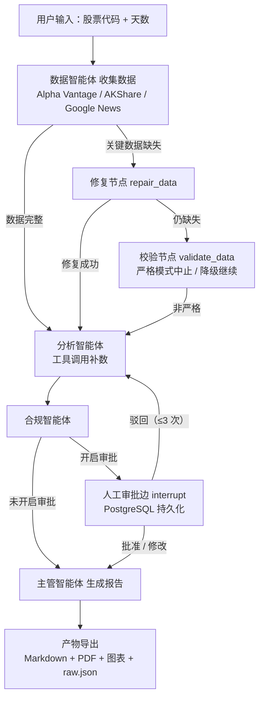

## 架构——多智能体股票研究系统

本文档描述多智能体股票研究系统的当前架构——一个由 LangGraph 驱动的流水线，支持多市场数据采集、条件路由、人工审批（HITL）以及完整的 Markdown/PDF 报告输出。

---
### 高层概览

流水线是一个带**条件路由**和**检查点（checkpointer）**的 LangGraph 状态图：

- **修复路径**：关键数据缺失时先尝试重新拉取，再进入分析；
- **分析智能体**：输入不完整时可自主调用行情/基本面工具补数；
- **人工审批边**（可选）：通过 `interrupt` 暂停运行，状态持久化到 PostgreSQL；
- **驳回回环**：驳回会带着意见回到分析智能体重写（最多 3 轮）。

#### 智能体与节点

| 智能体 / 节点 | 职责 |
|--------|------|
| **数据智能体** | 获取价格、基本面、新闻（美股 / A 股 / 港股） |
| **修复节点** | 重新拉取缺失的价格 / 利润表 / 关键指标 |
| **校验节点** | 严格模式中止，或降级为警告继续 |
| **分析智能体** | 生成分析；数据缺失时自主调用 `fetch_quote` / 价格 / 基本面工具 |
| **合规智能体** | 中性化过滤 + 禁用词移除 + 披露声明 |
| **审批边** | `interrupt` 人工审批：批准 / 驳回 / 修改，状态存 PostgreSQL |
| **主管智能体** | 最终报告组装（标题归一、日频指标） |

---
### 流程图



---
### 模块拆分

| 模块 | 说明 |
|------|------|
| `src/agents/*.py` | 数据 / 分析 / 合规 / 主管智能体 |
| `src/graph/orchestrator.py` | LangGraph 构建、条件路由、审批边、流水线 |
| `src/tools/*.py` | price / quote / hk / fundamentals / news / plot / pdf 工具 |
| `src/utils/checkpointer.py` | PostgreSQL 检查点（无库时回退内存） |
| `src/api.py` | FastAPI 后端（`/analyze` + 异步 `/api/research`、SSE `/stream`、`/metrics`） |
| `frontend/` | Vue 3 + TS + Pinia + Router + Element Plus UI（SSE 实时进度） |
| `src/runtime/` | 异步运行时：runs 注册表（asyncpg）、SSE 事件总线、分层记忆、限流器、runner |
| `src/observability/` | Prometheus 指标、LLM token/成本埋点 |
| `src/celery_app.py` | Celery App（Redis broker、优先级/死信队列） |
| `src/tasks.py` | Celery 任务：run / resume 研究、死信处理 |
| `src/cli.py` | CLI 入口 |
| `config/settings.yaml` | LLM 提供方、严格模式、新闻源、编排配置 |

---

### 异步运行时与基础设施

- `POST /api/research` 立即返回 `run_id`；**Celery worker** 执行 LangGraph 流水线。
- 图节点事件经共享 `stream_graph` 发布到 **Redis 事件总线**，并通过 **SSE**（`/api/research/{id}/stream`）推送给前端。
- run 状态与 `result` 持久化到 **Postgres**（`research_runs`，asyncpg）；HITL 审批从 **Postgres checkpoint** 恢复（`/api/research/{id}/decision`）。
- **Redis** 还用于基本面 / 短期记忆缓存与按源的限流器。
- **分层记忆**：短期（Redis 滑动窗口）+ 长期（Postgres pgvector，重要性 / 时间衰减 / 检索）+ 压缩（LLM 摘要 / 裁剪）。
- **可观测**：`/metrics`（Prometheus：LLM token / 成本 / 耗时、节点耗时、数据源错误、run 状态）+ 结构化 JSON 日志 + 自动导入的 Grafana 面板。
- **可选 API 鉴权**：在 `.env` 设 `API_KEY` 后，写端点（submit / decision / analyze）需 `X-API-Key`，并由 Redis 限流器限流。
- **报告下载 / 预览**：`/artifacts/{symbol}/{file}`。
- **部署**：`docker compose up -d --build` → api / worker / db(pgvector) / redis / frontend(nginx) / prometheus / grafana。

---

#### 支持的模式

| 模式 | 行为 |
|------|------|
| `strict` | 修复后关键数据仍缺失时流水线中止 |
| `relaxed` | 以警告 / “N/A” 占位并继续生成 |
| HITL | 可选审批边；状态持久化到 PostgreSQL 可恢复 |

如需覆盖严格模式行为，编辑：
```yaml
# config/settings.yaml
StrictMode:
  strict_mode: false
```
