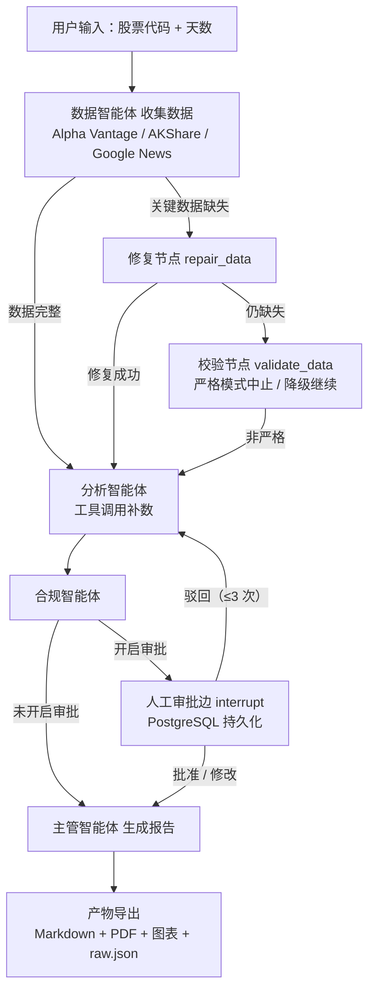

## Architecture – MultiAgent Stock Research System

This document describes the current architecture of the MultiAgent Stock Research system — a LangGraph-powered pipeline for automated equity analysis, multi-market data collection, human-in-the-loop approval, and full Markdown/PDF reporting.

---
### High-Level Overview

The pipeline is a LangGraph state graph with **conditional routing** and **checkpointing**:

- A **repair path** retries missing critical data before analysis;
- The **Analyst Agent** can call data tools itself when inputs are incomplete;
- An optional **human approval edge** pauses the run (via `interrupt`) and persists state to PostgreSQL;
- Rejections loop back to the analyst with feedback (max 3 rounds).

#### Agents & Nodes

| Agent / Node           | Responsibilities                                                        |
| ---------------------- | ----------------------------------------------------------------------- |
| **Data Agent**         | Fetches prices, fundamentals, news (US / A-share / HK)                   |
| **Repair Node**        | Re-fetches missing prices / income statement / key metrics              |
| **Validate Node**      | Enforces strict mode or degrades with warnings                          |
| **Analyst Agent**      | Generates commentary; calls `fetch_quote` / price / fundamentals tools when data is missing |
| **Compliance Agent**   | Neutrality filter + forbidden-phrase removal + disclosures              |
| **Approval Edge**      | `interrupt` HITL: approve / reject / edit, state persisted in Postgres  |
| **Supervisor Agent**   | Final report assembly (heading normalization, daily metrics)            |

---
### Flow Diagram



---
### Module Breakdown

| Module                        | Description                                                       |
| ----------------------------- | ----------------------------------------------------------------- |
| `src/agents/*.py`             | Data / Analyst / Compliance / Supervisor agents                  |
| `src/graph/orchestrator.py`   | LangGraph builder, conditional routing, approval edge, pipeline  |
| `src/tools/*.py`              | price / quote / hk / fundamentals / news / plot / pdf tools      |
| `src/utils/checkpointer.py`   | PostgreSQL checkpointer (falls back to in-memory)                |
| `src/api.py`                  | FastAPI backend (`/analyze`, `/analyze/approve`)                 |
| `src/ui/streamlit_app.py`     | Streamlit web UI (collapsible report sections, approval panel)   |
| `src/cli.py`                  | CLI entry-point                                                  |
| `config/settings.yaml`        | LLM provider, strict mode, news sources, orchestration settings  |

---
#### Supported Modes

| Mode      | Behavior                                                          |
| --------- | ----------------------------------------------------------------- |
| `strict`  | Pipeline stops if critical data is still missing after repair     |
| `relaxed` | Fills gaps with warnings / “N/A” and continues                    |
| HITL      | Optional approval edge; state persisted in PostgreSQL for resume  |

To override strict behavior, edit:
```yaml
# config/settings.yaml
StrictMode:
  strict_mode: false
```

---

# 中文版（全文翻译）| Chinese Version

## 架构——多智能体股票研究系统

本文档描述多智能体股票研究系统的当前架构——一个由 LangGraph 驱动的流水线，支持多市场数据采集、条件路由、人工审批（HITL）以及完整的 Markdown/PDF 报告输出。

---
### 高层概览

流水线是一个带**条件路由**和**检查点（checkpointer）**的 LangGraph 状态图：

- **修复路径**：关键数据缺失时先尝试重新拉取，再进入分析；
- **分析智能体**：输入不完整时可自主调用行情/基本面工具补数；
- **人工审批边**（可选）：通过 `interrupt` 暂停运行，状态持久化到 PostgreSQL；
- **驳回回环**：驳回会带着意见回到分析智能体重写（最多 3 轮）。

#### 智能体与节点

| 智能体 / 节点 | 职责 |
|--------|------|
| **数据智能体** | 获取价格、基本面、新闻（美股 / A 股 / 港股） |
| **修复节点** | 重新拉取缺失的价格 / 利润表 / 关键指标 |
| **校验节点** | 严格模式中止，或降级为警告继续 |
| **分析智能体** | 生成分析；数据缺失时自主调用 `fetch_quote` / 价格 / 基本面工具 |
| **合规智能体** | 中性化过滤 + 禁用词移除 + 披露声明 |
| **审批边** | `interrupt` 人工审批：批准 / 驳回 / 修改，状态存 PostgreSQL |
| **主管智能体** | 最终报告组装（标题归一、日频指标） |

---
### 流程图


---
### 模块拆分

| 模块 | 说明 |
|------|------|
| `src/agents/*.py` | 数据 / 分析 / 合规 / 主管智能体 |
| `src/graph/orchestrator.py` | LangGraph 构建、条件路由、审批边、流水线 |
| `src/tools/*.py` | price / quote / hk / fundamentals / news / plot / pdf 工具 |
| `src/utils/checkpointer.py` | PostgreSQL 检查点（无库时回退内存） |
| `src/api.py` | FastAPI 后端（`/analyze`、`/analyze/approve`） |
| `src/ui/streamlit_app.py` | Streamlit Web UI（报告可折叠、审批面板） |
| `src/cli.py` | CLI 入口 |
| `config/settings.yaml` | LLM 提供方、严格模式、新闻源、编排配置 |

---
#### 支持的模式

| 模式 | 行为 |
|------|------|
| `strict` | 修复后关键数据仍缺失时流水线中止 |
| `relaxed` | 以警告 / “N/A” 占位并继续生成 |
| HITL | 可选审批边；状态持久化到 PostgreSQL 可恢复 |

如需覆盖严格模式行为，编辑：
```yaml
# config/settings.yaml
StrictMode:
  strict_mode: false
```
